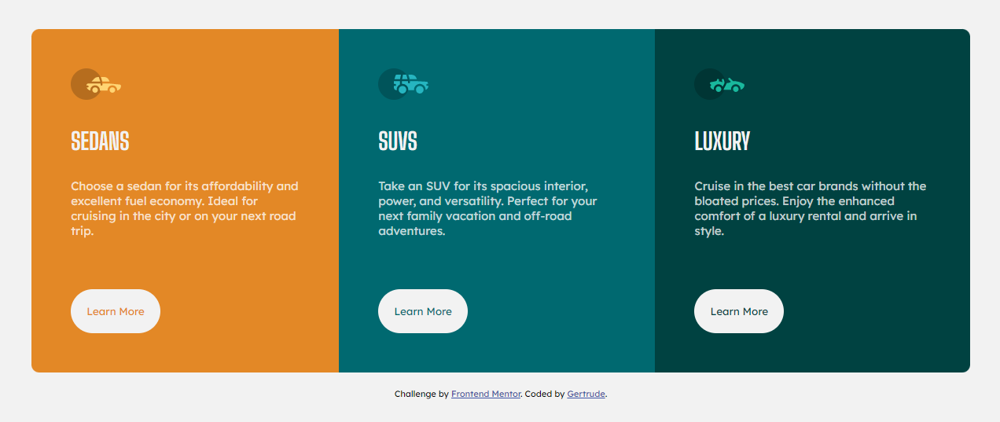

# Frontend Mentor - 3-column preview card component solution

This is a solution to the [3-column preview card component challenge on Frontend Mentor](https://www.frontendmentor.io/challenges/3column-preview-card-component-pH92eAR2-). Frontend Mentor challenges help you improve your coding skills by building realistic projects.

## Table of contents

- [Overview](#overview)
  - [The challenge](#the-challenge)
  - [Screenshot](#screenshot)
  - [Links](#links)
- [My process](#my-process)
  - [Built with](#built-with)
  - [What I learned](#what-i-learned)
  - [Useful resources](#useful-resources)
- [Author](#author)

## Overview

### The challenge

Users should be able to:

- View the optimal layout depending on their device's screen size
- See hover states for interactive elements

### Screenshot



### Links

- Solution URL: [Git Hub | 3-Column-Preview](https://github.com/TrudyCyns/3-Column-Preview)
- Live Site URL: [Vercel | 3-Column-Preview](https://3-column-preview-coral.vercel.app)

## My process

### Built with

- Semantic HTML5 markup
- CSS custom properties
- Flexbox

### What I learned

I learnt how to set border radiuses for different corners of a container.

```css
#sedans {
  border-radius: 10px 10px 0px 0px;
}
```

### Useful resources

- [w3schools](https://www.w3schools.com/CSSref/css3_pr_border-radius.asp) - This helped me figure out how I could manipulate the border radius. I really liked this pattern and will use it going forward.

## Author

- Frontend Mentor - [@TrudyCyns](https://www.frontendmentor.io/profile/TrudyCyns
)
